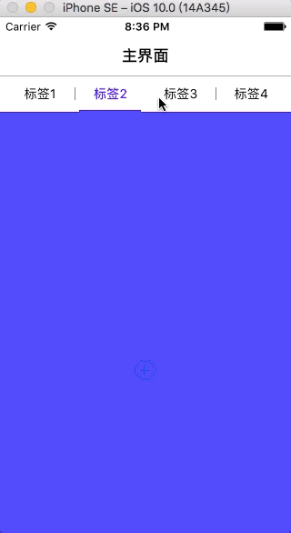

# YLPageScrollController
简单几句代码集成Tab界面。


## Installation【安装】

#### From CocoaPods【使用CocoaPods】

```
pod 'YLPageScrollController'
```

## Manually【手动导入】

- **Drag all source files under floder YLPageScrollController to your project.【将YLPageScrollController文件夹中的所有源代码拽入项目中】**

- **Import the main header file：#import "YLTabScrollPageController.h" 【导入主头文件：#import "YLTabScrollPageController.h"】**

## Examples【示例】
- 详情见YLPageScrollControllerDemo